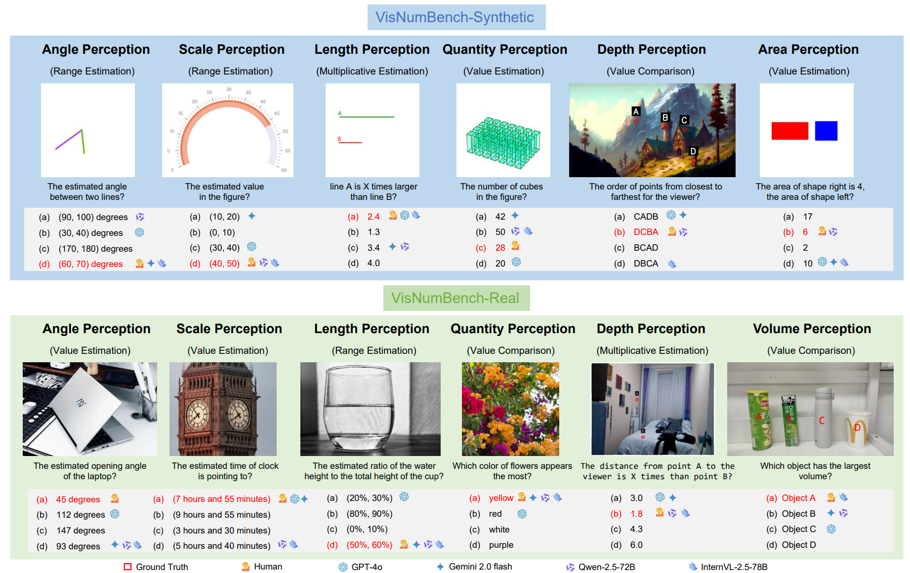
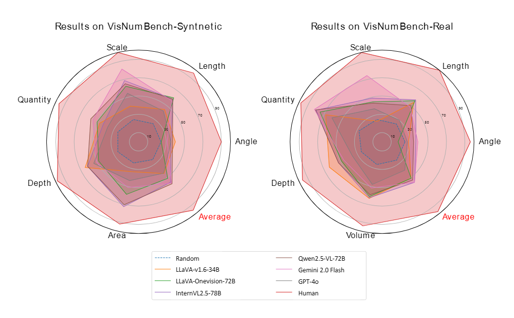

# VisNumBench: Evaluating Number Sense of Multimodal Large Language Models

This repo contains evaluation code for the paper "[VisNumBench: Evaluating Number Sense of Multimodal Large Language Models](https://arxiv.org/abs/2404.12390.pdf)"

​																[**🌐 Homepage**](https://wwwtttjjj.github.io/VisNumBench/) | [**🤗 Dataset**](https://huggingface.co/datasets/wwwtttjjj/VisNumBench) | [**📑 Paper**](https://arxiv.org/pdf/2503.14939v1) | [**📖 arXiv**](https://arxiv.org/abs/2503.14939v1)


## Introduction

Can Multimodal Large Language Models (MLLMs) develop an intuitive number sense similar to humans? Targeting this problem, we introduce Visual Number Benchmark (<b>VisNumBench</b>) to evaluate the number sense abilities of MLLMs across a wide range of visual numerical tasks. <b>VisNumBench</b> consists of about multiple-choice question-answer pairs derived from both synthetic and real-world visual data, covering seven visual numerical attributes and four types of visual numerical estimation tasks. Our experiments on <b>VisNumBench</b> led to the following key findings: (i) The 17 MLLMs we tested—including open-source models such as Qwen2.5-VL and InternVL2.5, as well as proprietary models like GPT-4o and Gemini 2.0 Flash—perform significantly below human levels in number sense-related tasks. (ii) Multimodal mathematical models and multimodal chain-of-thought (CoT) models did not exhibit significant improvements in number sense abilities. (iii) Stronger MLLMswith larger parameter sizes and broader general abilities demonstrate modest gains in number sense abilities. We believe <b>VisNumBench</b> will serve as a valuable resource for the research community, encouraging further advancements in enhancing LVLMs' number sense abilities.


## Dataset Creation

VisNumBench aims to advance the development of multimodal large language models in visual numerical understanding by evaluating their number sense capabilities. This benchmark is dedicated to bridging the gap between abstract mathematical problem-solving and real-world applications in current multimodal models. Please refer to our huggingface [**🤗 Dataset**](https://huggingface.co/datasets/wwwtttjjj/VisNumBench) for more details.

## Load Dataset

```
import datasets

dataset_name = 'wwwtttjjj/VisNumBench'
data = load_dataset(dataset_name)
```
`Attributes` is one of the attributes: `['Angle', 'Length', 'Scale', 'Depth', 'Quantity', 'Depth', 'Area', 'Volume']`;

`task_class` is one of the tasks: `['Range Estimation', 'Value Comparison', 'Value Estimation', 'Multiplicative Estimation']`.

## Evaluation
Please refer to our [eval](eval)folder for more details.



## 🏆 Leaderboard

| Model                      | VisNumBench-Synthetic (1,011) | VisNumBench-Real (902) |
|----------------------------|:-----------:|:------------:|
| 🏅**Human**          |             95.33             |         97.33          |
| 🥈Gemini 2.0 Flash   |             57.57             |       **56.54**        |
| 🥉InternVL2.5-78B    |             56.18             |       **56.54**        |
| Qwen2.5-VL-72B      |           **58.46**           |         53.33          |
| InternVL2.5-38B     |             55.59             |         52.11          |
| LLaVA-Onevision-72B |             50.84             |         50.78          |
| Qwen2-VL-72B        |             54.20             |         46.56          |
| LLaVA-v1.6-34B      |             44.31             |         50.55          |
| Gemini 1.5 Pro      |             44.02             |         48.67          |
| InternVL2-40B       |             45.5              |         45.12          |
| Qwen2.5-VL-7B       |             46.19             |         41.02          |
| Llama-VL-3_2-11B    |             43.92             |         43.24          |
| Qwen2.5-VL-3B       |             42.43             |         42.57          |
| Qwen2-VL-7B         |             42.24             |         41.91          |
| Llama-3.2V-11B-cot  |             45.50             |         38.36          |
| GPT-4o              |             43.72             |         39.58          |
| InternVL2-8B-MPO    |             40.65             |         39.91          |
| LLaVA-Onevision-7B  |             39.96             |         40.58          |
| InternVL2.5-8B      |             39.66             |         40.13          |
| InternVL2-8B        |             39.56             |         39.58          |
| R1-Onevision-7B     |             38.87             |         38.25          |
| LLaVA-v1.5-13B      | 32.15 | 40.02 |
| LLaVA-v1.6-34B      | 32.15 | 40.02 |
| Janus-Pro-7B        | 37.69 | 34.26 |
| Phi-3.5-vision      | 32.34 | 37.25 |
| Math-LLaVA-13B      | 35.81 | 33.15 |
| Gemini 1.5 Flash    | 33.33 | 33.7 |
| LLaVA-v1.5-7B       | 29.38 | 28.49 |
| Qwen2-VL-2B | 31.85 | 24.94 |
| 👀 **Random** | 24.76 | 25.54 |
|  |  |  |

## Disclaimers

VisNumBench utilizes image data from multiple sources.  We have made every effort to ensure that the images included in this work comply with applicable copyright laws and are properly credited. However, if you are the copyright holder of any image included in our work and believe that its use conflicts with your licensing agreement, please [contact](#contact) us directly. We are committed to promptly addressing any legitimate concerns.

## Contact
- Tengjin Weng: wtjdsb@gmail.com
- Wenhao Jiang:cswhjiang@gmail.com

## Citation

**BibTeX:**
```bibtex
@article{weng2025visnumbench,
title={VisNumBench: Evaluating Number Sense of Multimodal Large Language Models},
author={Tengjin Weng and Wenhao Jiang and Jingyi Wang and Zhong Ming},
journal={arXiv preprint arXiv:2503.14939},
year={2025}
}
```
